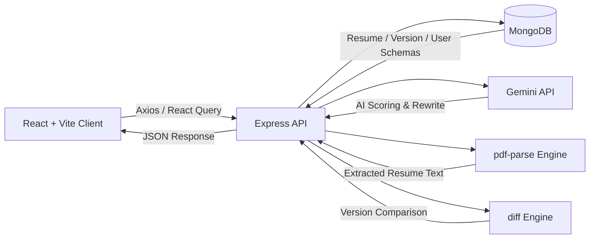
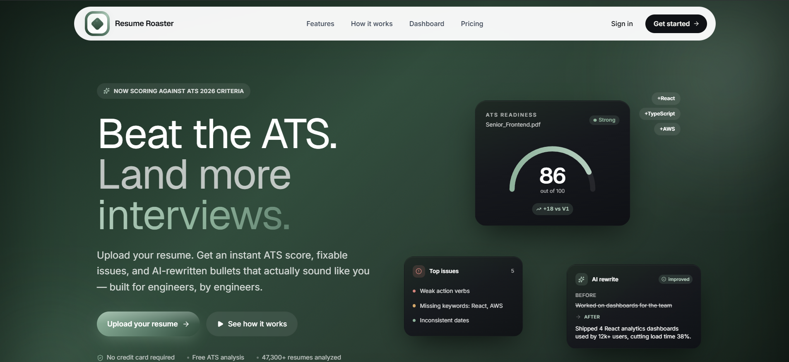
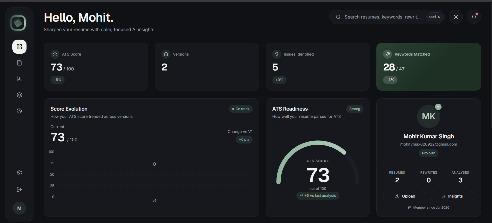
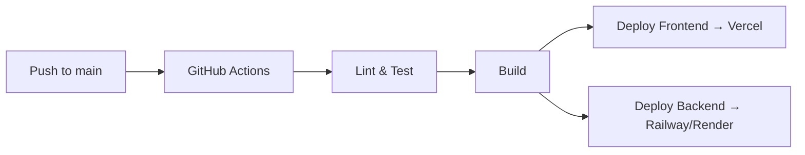

<div align="center">


<br />


# 📄🔥 Resume Roaster

### AI-Powered ATS Resume Analyzer, Scorer & Optimizer — Built for Engineers


<br />

<!-- Badges -->
<p>
  
  
  
  
</p>

<p>
  
  
  
  
  
</p>

<p>
  
</p>

<br />

<p>
  <a href="https://resume--roaster.vercel.app/dashboard"></a>
  <a href="#-table-of-contents"></a>
  <a href="https://github.com/VM-AX/ai-resume-roaster"></a>
  <a href="https://github.com/VM-AX/ai-resume-roaster/issues/new"></a>
</p>

</div>

<br />

> [!TIP]
> **Resume Roaster** parses your resume, scores it against real ATS parsing rules (Greenhouse, Lever, Workday), and uses Google Gemini to rewrite weak bullet points into quantified, outcome-driven statements — all in seconds.

<br />

---

## 📚 Table of Contents

- [🎬 Project Preview](#-project-preview)
- [✨ Features](#-features)
- [🛠️ Tech Stack](#️-tech-stack)
- [🏗️ Architecture](#️-architecture)
- [📁 Folder Structure](#-folder-structure)
- [⚙️ Installation](#️-installation)
- [🔐 Environment Variables](#-environment-variables)
- [🚀 Usage](#-usage)
- [🔌 API Reference](#-api-reference)
- [🧩 Configuration](#-configuration)
- [📜 Project Scripts](#-project-scripts)
- [☁️ Deployment](#️-deployment)
- [🖼️ Screenshots](#️-screenshots)
- [🗺️ Roadmap](#️-roadmap)
- [⚡ Performance](#-performance)
- [🔒 Security](#-security)
- [🧪 Testing](#-testing)
- [🔁 CI/CD](#-cicd)
- [🤝 Contributing](#-contributing)
- [🎨 Code Style](#-code-style)
- [📄 License](#-license)
- [🙏 Acknowledgements](#-acknowledgements)
- [💬 Support](#-support)
- [❓ FAQ](#-faq)
- [👤 Author](#-author)
- [🌟 Star History](#-star-history)
- [👥 Contributors](#-contributors)
- [📊 Repo Stats](#-repo-stats)

---

## 🎬 Project Preview

<div align="center">

### Demo


</div>

<details>
<summary><b>📸 Click to view feature showcase</b></summary>

<br />

| ATS Score Analysis | AI Bullet Rewrite |
|:---:|:---:|
|  |  |

</details>

---

## ✨ Features

- 🎯 **ATS Score Analysis** — Instant 0–100 score benchmarked against Greenhouse, Lever, and Workday parsing rules, evaluating readability, keywords, formatting, and impact.
- ✨ **AI Bullet Point Rewrite** — Converts generic experience bullets into quantified, outcome-based statements powered by Gemini.
- 🔑 **Keyword Optimization** — Compares your resume against any job description to surface matching and missing keywords.
- 📊 **Score Evolution Dashboard** — Tracks scoring history across resume drafts with visual version comparisons.
- 📑 **Clean PDF Export** — Compiles your optimized resume into a polished, ATS-friendly PDF.
- 🔐 **Secure Auth** — JWT-based authentication for saving and managing resume versions.
- ⚡ **Fast & Modern UI** — Built with React, Vite, and Tailwind CSS v4 for a snappy experience.

> [!NOTE]
> All AI scoring and rewriting is powered by the **Google Gemini API** (`@google/genai`), with PDF ingestion handled via `pdf-parse`.

---

## 🛠️ Tech Stack

<div align="center">

### Frontend

| Category | Technology |
|---|---|
| Framework | React + Vite |
| Styling | Tailwind CSS (v4) |
| Animations | Framer Motion |
| Icons | Lucide React |
| Data Fetching | TanStack React Query + Axios |

### Backend

| Category | Technology |
|---|---|
| Server | Node.js + Express |
| Database | MongoDB + Mongoose |
| AI Integration | Google Gemini API (`@google/genai`) |
| Parsing | `pdf-parse` |
| Diff Engine | `diff` |

</div>

---

## 🏗️ Architecture



---

## 📁 Folder Structure

```text
├── assets/                     # Graphic resources and previews
├── backend/                    # Express API, MongoDB models, and Gemini integration
│   ├── src/
│   │   ├── config/             # DB & App Configuration
│   │   ├── middleware/         # Auth, validation, rate limiting
│   │   ├── models/             # Resume, Version, User schemas
│   │   ├── routes/             # Authentication & analysis API routing
│   │   └── services/           # Gemini API interface & scoring algorithms
│   └── package.json
└── ai-resume-checker-ui-boilerplate-code/  # React client application
    ├── src/
    │   ├── components/         # Modular layout, landing, and dashboard components
    │   ├── context/             # Auth, Theme, and UI context providers
    │   ├── pages/               # Landing, Login, Dashboard, Insights views
    │   └── routes.jsx           # React Router setup
    └── package.json
```

---

## ⚙️ Installation

### Prerequisites

- [Node.js](https://nodejs.org/) v20 or higher
- [MongoDB](https://www.mongodb.com/) running instance
- Google Gemini API Key

### 1️⃣ Clone the Repository

```bash
git clone https://github.com/VM-AX/ai-resume-roaster
cd ai-resume-roaster
```

### 2️⃣ Backend Setup

<details>
<summary><b>npm</b></summary>

```bash
cd backend
npm install
npm run dev
```
</details>

<details>
<summary><b>yarn</b></summary>

```bash
cd backend
yarn install
yarn dev
```
</details>

<details>
<summary><b>pnpm</b></summary>

```bash
cd backend
pnpm install
pnpm dev
```
</details>

<details>
<summary><b>bun</b></summary>

```bash
cd backend
bun install
bun run dev
```
</details>

### 3️⃣ Frontend Setup

<details>
<summary><b>npm</b></summary>

```bash
cd ai-resume-checker-ui-boilerplate-code
npm install
npm run dev
```
</details>

<details>
<summary><b>yarn</b></summary>

```bash
cd ai-resume-checker-ui-boilerplate-code
yarn install
yarn dev
```
</details>

<details>
<summary><b>pnpm</b></summary>

```bash
cd ai-resume-checker-ui-boilerplate-code
pnpm install
pnpm dev
```
</details>

<details>
<summary><b>bun</b></summary>

```bash
cd ai-resume-checker-ui-boilerplate-code
bun install
bun run dev
```
</details>

Open [`http://localhost:5173/`](http://localhost:5173/) in your browser to see the app live. 🎉

> [!TIP]
> Don't want to run it locally? Try the hosted version instead: **[resume--roaster.vercel.app/dashboard](https://resume--roaster.vercel.app/dashboard)**

---

## 🔐 Environment Variables

**`backend/.env`**

```env
PORT=5000
MONGO_URI=mongodb://localhost:27017/resume-roaster
GEMINI_API_KEY=your_gemini_api_key_here
JWT_SECRET=your_jwt_secret_here
```

**`ai-resume-checker-ui-boilerplate-code/.env`**

```env
VITE_API_URL=http://localhost:5000
```

> [!WARNING]
> Never commit `.env` files to version control. Add them to `.gitignore` and rotate any keys that are accidentally exposed.

---

## 🚀 Usage

```bash
# 1. Upload a resume (PDF)
POST /api/resume/upload

# 2. Trigger AI analysis
POST /api/resume/:id/analyze

# 3. Fetch ATS score + suggestions
GET /api/resume/:id/score

# 4. Export optimized resume as PDF
GET /api/resume/:id/export
```

Example client-side call:

```javascript
import axios from "axios";

const analyzeResume = async (resumeId) => {
  const { data } = await axios.post(
    `${import.meta.env.VITE_API_URL}/api/resume/${resumeId}/analyze`
  );
  return data;
};
```

---

## 🔌 API Reference

| Method | Endpoint | Description |
|---|---|---|
| `POST` | `/api/auth/register` | Register a new user |
| `POST` | `/api/auth/login` | Authenticate and receive a JWT |
| `POST` | `/api/resume/upload` | Upload a resume PDF |
| `POST` | `/api/resume/:id/analyze` | Run AI-powered ATS analysis |
| `GET` | `/api/resume/:id/score` | Retrieve ATS score & keyword breakdown |
| `GET` | `/api/resume/:id/versions` | Get score evolution history |
| `GET` | `/api/resume/:id/export` | Export optimized resume as PDF |

<details>
<summary><b>📥 Sample Request/Response</b></summary>

```json
// POST /api/resume/:id/analyze
{
  "jobDescription": "Looking for a backend engineer skilled in Node.js and MongoDB..."
}
```

```json
// Response
{
  "atsScore": 82,
  "matchedKeywords": ["Node.js", "MongoDB", "REST API"],
  "missingKeywords": ["Docker", "Kubernetes"],
  "suggestions": [
    "Quantify impact in bullet #3 with measurable metrics."
  ]
}
```
</details>

---

## 🧩 Configuration

| Setting | Location | Description |
|---|---|---|
| `PORT` | `backend/.env` | Port the Express server listens on |
| `MONGO_URI` | `backend/.env` | MongoDB connection string |
| `GEMINI_API_KEY` | `backend/.env` | Google Gemini API credential |
| `JWT_SECRET` | `backend/.env` | Secret used to sign JWT tokens |
| `VITE_API_URL` | `frontend/.env` | Base URL the client uses to reach the API |

---

## 📜 Project Scripts

| Script | Location | Description |
|---|---|---|
| `npm run dev` | `backend/` | Starts backend in development mode with hot reload |
| `npm start` | `backend/` | Starts backend in production mode |
| `npm run dev` | `frontend/` | Starts Vite development server |
| `npm run build` | `frontend/` | Builds optimized production frontend bundle |
| `npm run preview` | `frontend/` | Previews the production build locally |
| `npm run lint` | `frontend/` | Runs ESLint across the codebase |

---

## ☁️ Deployment

<details>
<summary><b>▲ Deploy to Vercel (Frontend)</b></summary>

```bash
npm i -g vercel
cd ai-resume-checker-ui-boilerplate-code
vercel --prod
```
Set `VITE_API_URL` in the Vercel project's environment variables.
</details>

<details>
<summary><b>🌐 Deploy to Netlify (Frontend)</b></summary>

1. Connect your GitHub repo in the Netlify dashboard.
2. Build command: `npm run build`
3. Publish directory: `dist`
4. Add `VITE_API_URL` under Site Settings → Environment Variables.
</details>

<details>
<summary><b>🐳 Deploy with Docker</b></summary>

```dockerfile
# backend/Dockerfile
FROM node:20-alpine
WORKDIR /app
COPY package*.json ./
RUN npm install --production
COPY . .
EXPOSE 5000
CMD ["npm", "start"]
```

```bash
docker build -t resume-roaster-backend ./backend
docker run -p 5000:5000 --env-file ./backend/.env resume-roaster-backend
```
</details>

<details>
<summary><b>🚂 Deploy to Railway (Backend)</b></summary>

1. Create a new Railway project and link this repository.
2. Set the root directory to `backend`.
3. Add environment variables from `.env`.
4. Railway auto-detects `npm start` as the run command.
</details>

<details>
<summary><b>🎨 Deploy to Render (Backend)</b></summary>

1. Create a new **Web Service** on Render.
2. Root directory: `backend`
3. Build command: `npm install`
4. Start command: `npm start`
5. Add environment variables from `.env`.
</details>

---

## 🖼️ Screenshots

<div align="center">

| Home | Dashboard |
|:---:|:---:|
|  |  |

</div>

---

## 🗺️ Roadmap

- [x] ATS score analysis engine
- [x] AI-powered bullet point rewriting
- [x] Keyword matching against job descriptions
- [x] Score evolution dashboard
- [x] PDF export
- [ ] Multi-language resume support
- [ ] Browser extension for one-click scoring
- [ ] LinkedIn profile import
- [ ] Team/recruiter collaboration mode
- [ ] Resume template marketplace

---

## ⚡ Performance

- **Lazy loading** of dashboard routes via React Router code-splitting.
- **Debounced** keyword-matching requests to reduce redundant API calls.
- **Indexed MongoDB queries** on `userId` and `resumeId` for fast version lookups.
- **Cached** Gemini responses per resume version to avoid duplicate AI calls.
- **Compressed** PDF exports for faster downloads.

---

## 🔒 Security

- 🔑 JWT-based authentication with short-lived access tokens.
- 🧂 Password hashing via bcrypt.
- 🚦 Rate limiting on upload and analysis endpoints.
- 🛡️ Input validation and sanitization on all API routes.
- 🔐 Environment secrets never committed to source control.

Found a vulnerability? Please see [Support](#-support) to report it responsibly.

---

## 🧪 Testing

```bash
# Backend
cd backend
npm run test

# Frontend
cd ai-resume-checker-ui-boilerplate-code
npm run test
```

> [!NOTE]
> Test coverage reports are generated in `/coverage` after running the test suite.

---

## 🔁 CI/CD



Automated via GitHub Actions on every push and pull request to `main`.

---

## 🤝 Contributing

Contributions, issues, and feature requests are welcome!

1. Fork the project
2. Create your feature branch: `git checkout -b feature/AmazingFeature`
3. Commit your changes: `git commit -m 'Add some AmazingFeature'`
4. Push to the branch: `git push origin feature/AmazingFeature`
5. Open a Pull Request

See [`CONTRIBUTING.md`](CONTRIBUTING.md) for detailed guidelines.

---

## 🎨 Code Style

- **ESLint** + **Prettier** enforced on the frontend.
- **Airbnb-style** conventions for Node.js/Express backend.
- Commit messages follow [Conventional Commits](https://www.conventionalcommits.org/).

---

## 📄 License

<div align="center">


Distributed under the **MIT License**. See [`LICENSE`](LICENSE) for more information.

</div>

---

## 🙏 Acknowledgements

- [Google Gemini API](https://ai.google.dev/) for powering AI analysis
- [Shields.io](https://shields.io/) for badges
- [Lucide Icons](https://lucide.dev/)
- [TanStack Query](https://tanstack.com/query)
- Open-source community ❤️

---

## 💬 Support

- 🐛 [Open an Issue](https://github.com/VM-AX/ai-resume-roaster/issues/new)
- 💡 [Start a Discussion](https://github.com/VM-AX/ai-resume-roaster/discussions)
- 📧 Email: `<support-email>`

---

## ❓ FAQ

<details>
<summary><b>Is my resume data stored permanently?</b></summary>
<br/>
Resumes are stored securely and tied to your account. You can delete any version at any time from the dashboard.
</details>

<details>
<summary><b>Which ATS systems are supported?</b></summary>
<br/>
Scoring rules are modeled after Greenhouse, Lever, and Workday parsing behavior.
</details>

<details>
<summary><b>Can I use this without an OpenAI/Gemini key?</b></summary>
<br/>
No — a valid Google Gemini API key is required for AI scoring and rewriting features.
</details>

<details>
<summary><b>Is there a free tier?</b></summary>
<br/>
This is an open-source, self-hosted project — running it locally or on your own infrastructure is free.
</details>

---

## 👤 Author

<div align="center">

**<Author Name>**

<a href="https://github.com/VM-AX"></a>
<a href="<LinkedIn Profile URL>"></a>
<a href="<Twitter/X Profile URL>"></a>
<a href="mailto:<author-email>"></a>

</div>

---

## 🌟 Star History

<div align="center">


</div>

---

## 👥 Contributors

<div align="center">

<a href="https://github.com/VM-AX/ai-resume-roaster/graphs/contributors">
  
</a>

</div>

---

## 📊 Repo Stats

<div align="center">


<br/>


</div>

---

<div align="center">

### ⭐ If you find this project useful, consider giving it a star!

<br/>

Made with ❤️‍🔥 and lots of ☕ by **<Author Name>**

<sub>© 2026 Resume Roaster. All rights reserved.</sub>

</div>
